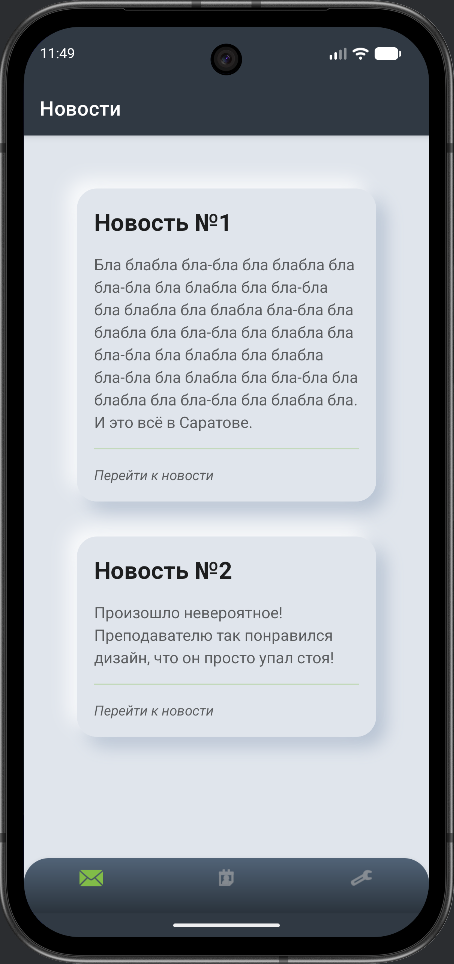
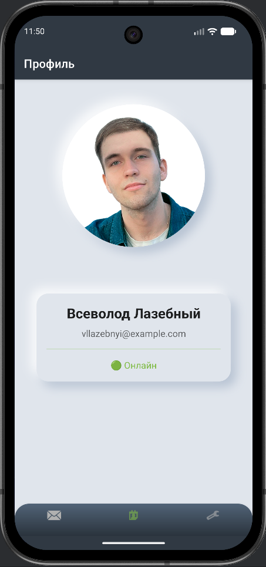
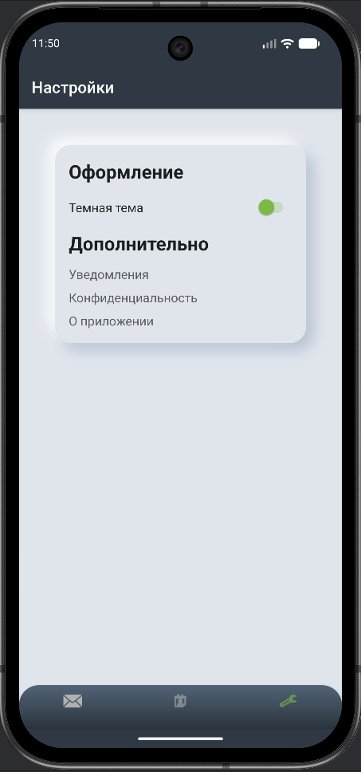
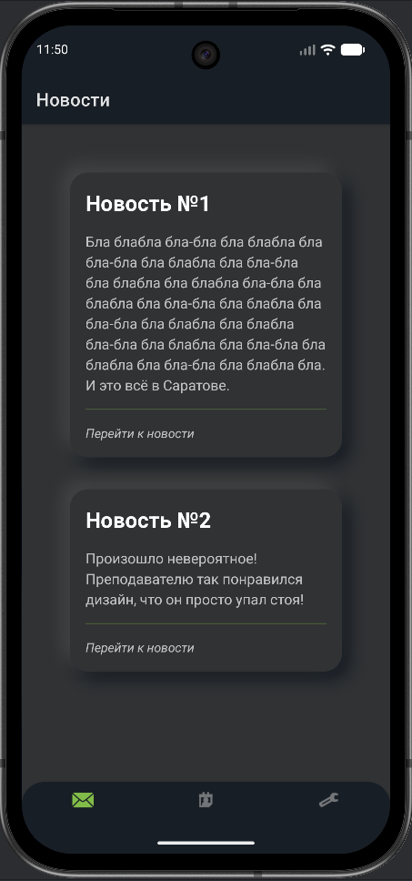
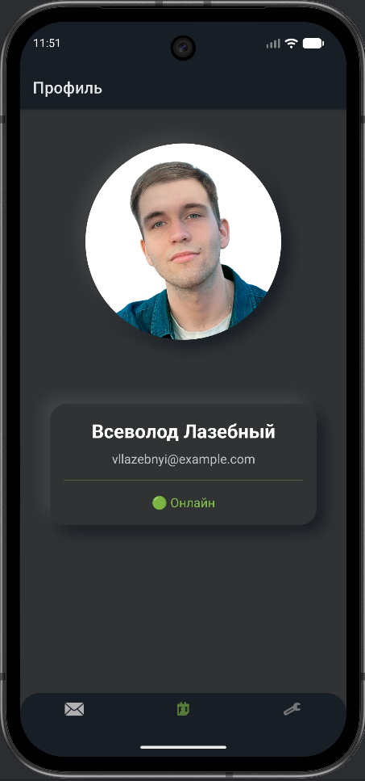
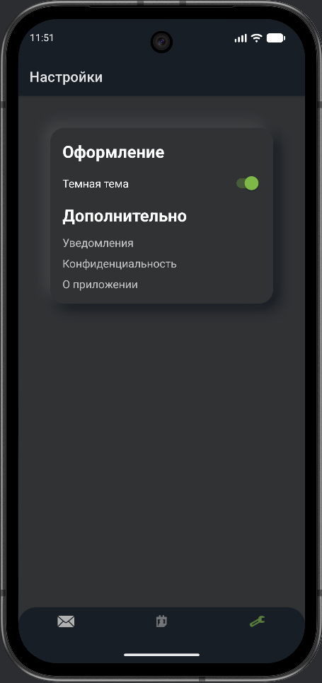

# Lab2
Мобильная разработка 4 курс Лабораторная работа 1 


## 🛠️ Технологический стек / Tech Stack

<div style="display: flex; flex-wrap: wrap; gap: 6px; margin-bottom: 15px;">
  
  
  
  
</div>

## 📱 Интерфейс приложения

### Светлая тема
<div style="display: flex; gap: 10px; margin-bottom: 20px;">
  
  
  
</div>

### Темная тема
<div style="display: flex; gap: 10px; margin-bottom: 20px;">
  
  
  
</div>


## Реализация

- Неоморфный дизайн интерфейса
- Поддержка темной и светлой темы
- Отслеживание жизненного цикла Activity
- Логирование событий жизненного цикла

## Архитектура

```
project

├── app
│   ├── build.gradle.kts
│   ├── proguard-rules.pro
│   └── src
│       └── main
│           ├── AndroidManifest.xml
│           ├── java
│           │   └── com
│           │       └── example
│           │           └── massenger
│           │               ├── FeedFragment.java
│           │               ├── MainActivity.java
│           │               ├── ProfileFragment.java
│           │               └── SettingsFragment.java
│           └── res
│               ├── drawable
│               │   ├── bottom_nav_gradient.xml
│               │   ├── ic_launcher_background.xml
│               │   ├── ic_launcher_foreground.xml
│               │   ├── icon_selector.xml
│               │   └── nano.png
│               ├── drawable-night
│               │   └── bottom_nav_gradient.xml
│               ├── layout
│               │   ├── activity_main.xml
│               │   ├── fragment_feed.xml
│               │   ├── fragment_profile.xml
│               │   └── fragment_settings.xml
│               ├── menu
│               │   └── bottom_nav_menu.xml
│               ├── mipmap *
│               ├── navigation
│               │   └── nav_graph.xml
│               ├── values
│               │   ├── colors.xml
│               │   ├── strings.xml
│               │   └── themes.xml
│               ├── values-night
│               │   ├── colors.xml
│               │   └── themes.xml
│               └── xml
│                   ├── backup_rules.xml
│                   └── data_extraction_rules.xml
├── build.gradle.kts
├── gradle
│   └── wrapper
│       ├── gradle-wrapper.jar
│       └── gradle-wrapper.properties
├── gradle.properties
├── gradlew
├── gradlew.bat
├── local.properties
└── settings.gradle.kts
```

## Зависимости

- `Android_neumorphic:1.2.0` для неоморфного дизайна
- `Android SDK 21`
- `Kotlin 1.9`

P.S. посмотрите другие проекты, поставьте звезды <3
